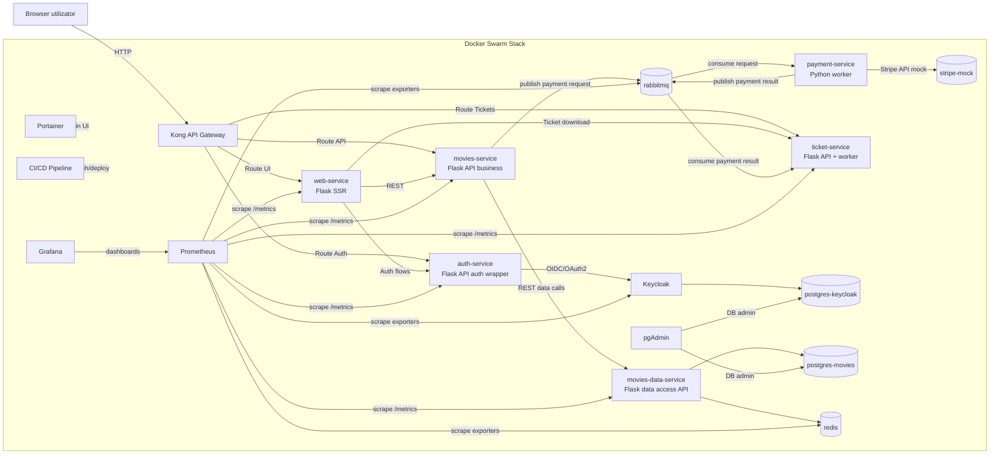

# MovieMesh

## 1. Informatii generale

- Nume proiect: MovieMesh
- Asistent laborator: George-Alexandru Tudor
- Tema proiectului: platforma cloud native pentru management cinema, rezervari, plati si emitere bilete

## 2. Formarea echipei si alegerea temei

### Echipa de proiect

- Membru 1: Dinu Florin-Cristian, grupa 342C3
- Membru 2: Chipuc Valentin-Daniel, grupa 343C1

### Tema aleasa

Tema proiectului este dezvoltarea unei aplicatii de tip microservicii pentru:

- autentificare si autorizare utilizatori
- administrare filme, sali si proiectii
- rezervare locuri si flux de plata
- generare bilete dupa confirmarea platii

### Descriere generala aplicatie

MovieMesh este o aplicatie pentru rezervari la cinematograf. Utilizatorul isi poate crea cont, se poate autentifica, poate vedea lista de filme disponibile, poate selecta ziua si ora unei proiectii, alege locurile in sala si poate finaliza plata.

Dupa confirmarea platii, aplicatia genereaza biletul electronic, iar utilizatorul il poate accesa din interfata. Sistemul pastreaza date despre filme, proiectii, sali, rezervari si bilete, astfel incat fluxul complet sa fie gestionat intr-un mod clar si organizat.

## 3. Arhitectura tehnica

### 3.1 Diagrama de arhitectura (componente, retele, comunicare)

Retele principale folosite in stack:

- cinema-net: trafic HTTP intern intre web-service, auth-service, movies-service si Keycloak.
- movies-data-net: trafic intern intre movies-service (business) si movies-data-service (data access).
- message-broker-net: comunicare asincrona prin RabbitMQ (movies-service, payment-service, ticket-service).
- keycloak-db-net: izolare trafic Keycloak <-> postgres-keycloak.
- movies-db-net: izolare trafic movies-data-service <-> postgres-movies.
- movies-cache-net: acces movies-data-service <-> redis.
- payment-stripe-net: acces payment-service <-> stripe-mock.

Expunerea publica a endpoint-urilor se face prin Kong (API Gateway), care aplica rutare unificata pentru UI/API si permite extinderea ulterioara cu politici de securitate (rate limiting, auth plugins, logging).

### 3.2 Delimitarea responsabilitatilor

#### Microservicii proprii (dezvoltate de echipa)

- web-service: interfata HTML/SSR pentru utilizator, orchestrat apelurile catre API-uri.
- auth-service: implementeaza logica de autentificare a aplicatiei (initiere login/register, callback OIDC, validare token, management cookie-uri sesiune).
- movies-service: API de business pentru filme/proiectii/sali/rezervari; aplica reguli de domeniu si initiaza plata asincrona, fara acces direct la DB.
- movies-data-service: serviciu dedicat pentru gestionare schema/date si acces la persistenta (CRUD, query-uri, cache), comunicand cu PostgreSQL si Redis.
- payment-service: worker asincron pentru procesarea cererilor de plata si emiterea rezultatului (success/fail).
- ticket-service: consumator evenimente de plata, generare bilet PDF + QR si expunere endpoint de descarcare bilet.

#### Componente suport (infrastructura)

- Keycloak: Identity Provider (IdP), user store, roluri, emitere token-uri OIDC/JWT.
- postgres-keycloak: persistenta pentru Keycloak.
- postgres-movies: persistenta pentru date business (filme, proiectii, rezervari).
- Redis: cache pentru date frecvent accesate.
- RabbitMQ: broker mesaje pentru fluxurile asincrone.
- stripe-mock: simulare gateway de plata in mediu de dezvoltare.
- Kong: API Gateway pentru expunere controlata si rutare a traficului extern catre microservicii.
- Portainer: administrare vizuala a cluster-ului Docker si a serviciilor.
- pgAdmin: administrare baze de date PostgreSQL in mediu de dezvoltare/test.
- Prometheus: colectare metrice prin scraping periodic.
- Grafana: vizualizare si alertare pe baza metricilor din Prometheus.
- CI/CD: pipeline automat pentru build, test, push imagini si deploy in Swarm.

## 4. Limbaje si framework-uri pe servicii

| Componenta | Limbaj | Framework/Biblioteci principale |
|---|---|---|
| web-service | Python 3 | Flask, Requests, PyJWT |
| auth-service | Python 3 | Flask, Requests, PyJWT |
| movies-service | Python 3 | Flask, Requests, Pika |
| movies-data-service | Python 3 | Flask, Flask-SQLAlchemy, Psycopg2, Redis |
| payment-service | Python 3 | Pika, Stripe SDK |
| ticket-service | Python 3 | Flask, Pika, ReportLab, qrcode |

Tehnologii concrete folosite in platforma:

- Backend microservicii: Python + Flask
- Persistenta relationala: PostgreSQL
- Cache: Redis
- Mesagerie asincrona: RabbitMQ
- Orchestrare/containere: Docker + Docker Swarm

## 5. Impartirea task-urilor in echipa

### Dinu Florin-Cristian

- arhitectura infrastructura Docker Swarm (stack, retele, volume, deploy policies)
- configurare gateway Kong (rute, expunere endpoint-uri)
- implementare movies-service (API business, integrare cu movies-data-service, publicare evenimente RabbitMQ)
- implementare movies-data-service (gestionare schema/date, integrare PostgreSQL/Redis)
- integrare observabilitate (Prometheus scraping + dashboard-uri Grafana)
- integrare Portainer/pgAdmin si politici de placement constraints pe workers

### Chipuc Valentin-Daniel

- implementare auth-service (flux login/register/callback, management sesiune, integrare Keycloak)
- implementare payment-service (worker consum plati, integrare stripe-mock, emitere rezultat)
- implementare ticket-service (consum evenimente plata, generare PDF+QR, endpoint descarcare)
- implementare web-service (UI Flask SSR, integrare cu auth-service/movies-service/ticket-service)
- configurare pipeline CI/CD (build, test, push imagini DockerHub, deploy)

## 6. DockerHub: cont si repository-uri

Cont DockerHub echipa: https://hub.docker.com/u/idp1

Repository-uri imagini aplicative:

- Auth service: https://hub.docker.com/r/idp1/auth-service
- Movies service: https://hub.docker.com/r/idp1/movies-service
- Movies data service: https://hub.docker.com/r/idp1/movies-data-service
- Payment service: https://hub.docker.com/r/idp1/payment-service
- Ticket service: https://hub.docker.com/r/idp1/ticket-service
- Web service: https://hub.docker.com/r/idp1/web-service

Componentele suport: RabbitMQ, Kong, Redis, PostgreSQL, Keycloak, Grafana, Prometheus, Portainer, pgAdmin.

## 7. Concluzie

MovieMesh este o aplicatie de sisteme distribuite pentru rezervarea locurilor la cinematograf, construita pe microservicii care separa clar autentificarea, gestionarea filmelor, platile si emiterea biletelor.