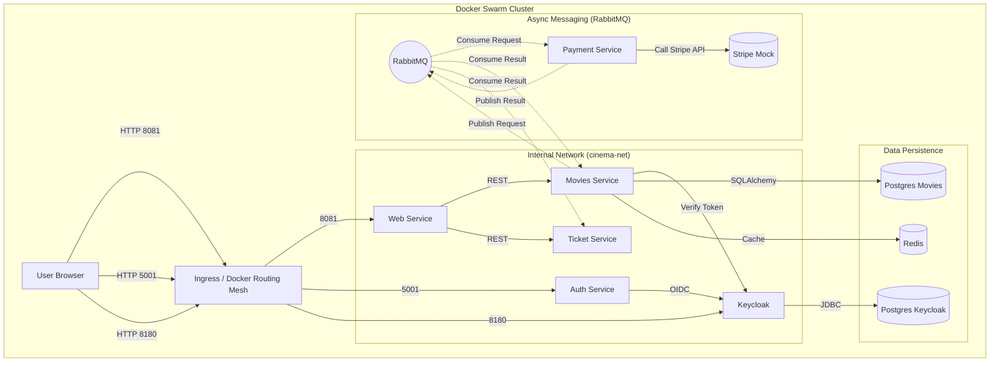

# 🎬 MovieMesh

A distributed cinema ticketing system built with Python (Flask), Docker Swarm, and Keycloak.

## 🏗️ Architecture Overview

The system is designed as a set of microservices communicating via REST APIs and RabbitMQ messages.

### Service Communication Schema



### 🌐 Networks

The stack isolates traffic using multiple overlay networks:

1.  **`cinema-net`**: The primary application network. Connects the Web frontend, Auth service, Movies API, and Keycloak.
2.  **`message-broker-net`**: Dedicated network for async background tasks. Connects Movies, Payment, Ticket services to RabbitMQ.
3.  **`keycloak-db-net`**: Isolated network connecting Keycloak to its Postgres database.
4.  **`movies-db-net`**: Isolated network connecting Movies Service to its Postgres database.
5.  **`movies-cache-net`**: Dedicated channel for Redis caching validation.
6.  **`payment-stripe-net`**: Connects the Payment service to the Stripe Mock server.

### 💾 Persistence & Volumes

- **`keycloak_data`**, **`movies_data`**: PostgreSQL data volumes (Persistent).
- **`redis_data`**: Redis AOF persistence data.
- **`rabbitmq_data`**: Message queues persistence.
- **`tickets_data`**: Shared volume where generated PDF tickets are stored.

### 🔍 DNS & Service Discovery

In the Swarm mesh, services address each other by their service name (Internal DNS):

- `keycloak`: Identity Provider
- `postgres-movies`, `postgres-keycloak`: Databases
- `rabbitmq`: Broker
- `web-service`, `movies-service`: Application logic

---

## 🧩 Microservices Explained

1.  **Web Service** (`Port 8081`): The frontend application (Server-Side Rendered Flask). It serves HTML pages and calls the backend APIs.
2.  **Auth Service** (`Port 5001`): A helper service that constructs OIDC URLs for login/registration and handles callbacks from Keycloak.
3.  **Movies Service** (`Port 5002`): The core backend. Manages movies, screenings, and rooms. It handles reservation logic and publishes payment requests to RabbitMQ.
4.  **Payment Service** (Worker): Listens for payment requests. Simulates credit card processing via Stripe (Mock) and publishes payment success/failure events.
5.  **Ticket Service** (`Port 5003`): Listens for successful payment events. Generates PDF tickets with QR codes and serves them to the user.
6.  **Keycloak** (`Port 8180`): The Authorization Server. Handles user management, roles, and issues JWT tokens.
7.  **RabbitMQ**: Handles asynchronous communication between the Movies, Payment, and Ticket services.
8.  **Redis**: Caches data for the Movies service to improve performance.

---

## 🚀 How to Run

### Prerequisites

- Docker & Docker Compose
- Initialize Docker Swarm mode (if not already done):
  ```bash
  docker swarm init
  ```

### Option A: Manual Build & Deploy

If you want to build images one by one manually:

```bash
# 1. Build the services
docker build -t cinemaapp/auth-service:latest ./services/auth-service
docker build -t cinemaapp/movies-service:latest ./services/movies-service
docker build -t cinemaapp/payment-service:latest ./services/payment-service
docker build -t cinemaapp/ticket-service:latest ./services/ticket-service
docker build -t cinemaapp/web-service:latest ./services/web-service

# 2. Deploy the stack
docker stack deploy -c docker-stack.yml cinema_stack
```

### Option B: Compose Build & Deploy (Recommended)

You can use `docker-compose` to build all images defined in the stack file at once, then deploy.

```bash
# 1. Build all images together
docker-compose -f docker-stack.yml build

# 2. Deploy to Swarm
docker stack deploy -c docker-stack.yml cinema_stack
```

### Accessing the App

Wait for a minute for all containers to start and Keycloak to initialize.

1.  **Main Interface**: [http://localhost:8081](http://localhost:8081)
2.  **Keycloak Admin**: [http://localhost:8180](http://localhost:8180) (user: `admin`, pass: `admin`)
3.  **RabbitMQ Manager**: [http://localhost:15672](http://localhost:15672) (user: `guest`, pass: `guest`)

### Stopping the Project

To remove the stack and stop all services:

```bash
docker stack rm cinema_stack
```
