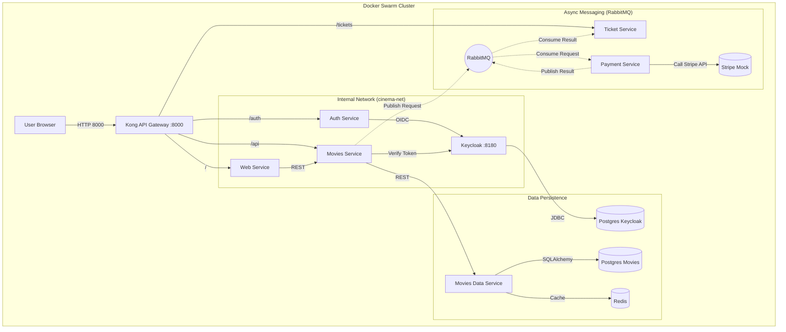

# 🎬 MovieMesh

A distributed cinema ticketing system built with Python (Flask), Docker Swarm, and Keycloak.

## 🏗️ Architecture Overview

The system is designed as a set of microservices communicating via REST APIs and RabbitMQ messages.

### Service Communication Schema


```mermaid
graph TD
    Client[User Browser]

    subgraph "Docker Swarm Cluster"
        Kong[Kong API Gateway :8000]

        Client -->|HTTP 8000| Kong

        Kong -->|/| Web[Web Service]
        Kong -->|/auth| Auth[Auth Service]
        Kong -->|/api| Movies[Movies Service]
        Kong -->|/tickets| Ticket[Ticket Service]

        subgraph "Internal Network (cinema-net)"
            Web -->|REST| Movies
            Auth -->|OIDC| KC[Keycloak :8180]
            Movies -->|Verify Token| KC
        end

        subgraph "Data Persistence"
            KC -->|JDBC| DB_KC[(Postgres Keycloak)]
            Movies -->|REST| MoviesData[Movies Data Service]
            MoviesData -->|SQLAlchemy| DB_Mov[(Postgres Movies)]
            MoviesData -->|Cache| Redis[(Redis)]
        end

        subgraph "Async Messaging (RabbitMQ)"
            Movies -.->|Publish Request| RMQ((RabbitMQ))
            RMQ -.->|Consume Request| Pay[Payment Service]
            Pay -- Call Stripe API --> Stripe[(Stripe Mock)]
            Pay -.->|Publish Result| RMQ
            RMQ -.->|Consume Result| Ticket
        end
    end
```

### 🌐 Networks

The stack isolates traffic using multiple overlay networks:

1.  **`cinema-net`**: The primary application network. Connects Kong, Web, Auth, Movies, Ticket services and Keycloak.
2.  **`movies-api-net`**: Internal network between Movies Service and Movies Data Service.
3.  **`message-broker-net`**: Dedicated network for async background tasks. Connects Movies, Payment, Ticket services to RabbitMQ.
4.  **`keycloak-db-net`**: Isolated network connecting Keycloak to its Postgres database.
5.  **`movies-db-net`**: Isolated network connecting Movies Data Service to its Postgres database.
6.  **`movies-cache-net`**: Dedicated channel for Redis caching.
7.  **`payment-stripe-net`**: Connects the Payment service to the Stripe Mock server.

### 💾 Persistence & Volumes

- **`keycloak_data`**, **`movies_data`**: PostgreSQL data volumes (Persistent).
- **`redis_data`**: Redis AOF persistence data.
- **`rabbitmq_data`**: Message queues persistence.
- **`tickets_data`**: Shared volume where generated PDF tickets are stored.

### 🔍 DNS & Service Discovery

In the Swarm mesh, services address each other by their service name (Internal DNS):

- `keycloak`: Identity Provider
- `postgres-movies`, `postgres-keycloak`: Databases
- `rabbitmq`: Broker
- `web-service`, `movies-service`: Application logic

---

## 🧩 Microservices Explained

1.  **Kong API Gateway** (`Port 8000`): Single public entry point. Routes all external traffic to the appropriate internal service.
2.  **Web Service** (internal): The frontend application (Server-Side Rendered Flask). Served via Kong at `/`.
3.  **Auth Service** (internal): Constructs OIDC URLs for login/registration and handles callbacks from Keycloak. Served via Kong at `/auth`.
4.  **Movies Service** (internal): The core backend. Manages movies, screenings, and rooms. Served via Kong at `/api`.
5.  **Movies Data Service** (internal): Dedicated data access layer. Handles all DB and cache operations for the Movies Service.
6.  **Payment Service** (Worker): Listens for payment requests. Simulates credit card processing via Stripe (Mock) and publishes payment success/failure events.
7.  **Ticket Service** (internal): Listens for successful payment events. Generates PDF tickets with QR codes. Served via Kong at `/tickets`.
8.  **Keycloak** (`Port 8180`): The Authorization Server. Handles user management, roles, and issues JWT tokens.
9.  **RabbitMQ**: Handles asynchronous communication between the Movies, Payment, and Ticket services.
10. **Redis**: Caches data for the Movies Data service to improve performance.

---

## 🚀 How to Run

### Prerequisites

- Docker & Docker Compose
- Initialize Docker Swarm mode (if not already done):
  ```bash
  docker swarm init
  ```

### Option A: Manual Build & Deploy

If you want to build images one by one manually:

```bash
# 1. Build the services
docker build -t cinemaapp/auth-service:latest ./services/auth-service
docker build -t cinemaapp/movies-service:latest ./services/movies-service
docker build -t cinemaapp/payment-service:latest ./services/payment-service
docker build -t cinemaapp/ticket-service:latest ./services/ticket-service
docker build -t cinemaapp/web-service:latest ./services/web-service

# 2. Deploy the stack
docker stack deploy -c docker-stack.yml cinema_stack
```

### Option B: Compose Build & Deploy (Recommended)

You can use `docker-compose` to build all images defined in the stack file at once, then deploy.

```bash
# 1. Build all images together
docker-compose -f docker-stack.yml build

# 2. Deploy to Swarm
docker stack deploy -c docker-stack.yml cinema_stack
```

### Accessing the App

Wait for a minute for all containers to start and Keycloak to initialize.

#### Application (via Kong)

| URL | Description |
|-----|-------------|
| [http://localhost:8000](http://localhost:8000) | Main UI (web-service) |
| [http://localhost:8000/auth/signin](http://localhost:8000/auth/signin) | Login |
| [http://localhost:8000/api/movies](http://localhost:8000/api/movies) | Movies API |
| [http://localhost:8000/tickets/\<filename\>](http://localhost:8000/tickets/) | Ticket download |

#### Admin Tools

| URL | Description |
|-----|-------------|
| [http://localhost:8001](http://localhost:8001) | Kong Admin API |
| [http://localhost:8180](http://localhost:8180) | Keycloak Admin (user: `admin`, pass: `admin`) |
| [http://localhost:15672](http://localhost:15672) | RabbitMQ Manager (user: `guest`, pass: `guest`) |
| [http://localhost:5050](http://localhost:5050) | pgAdmin (user: `admin@moviemesh.com`, pass: `admin`) |
| [http://localhost:9000](http://localhost:9000) | Portainer |

### Stopping the Project

To remove the stack and stop all services:

```bash
docker stack rm cinema_stack
```
